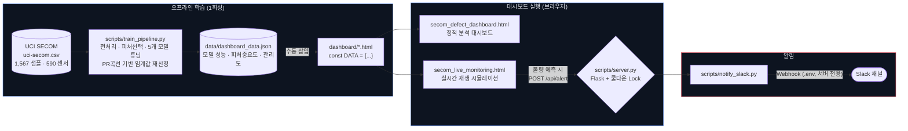

# SECOM 공정 수율 제어 — 극단적 클래스 불균형 하 센서 기반 불량 판별 및 실시간 알림 시스템

> **TL;DR**
> - **문제**: 반도체 웨이퍼 590개 센서 데이터, 불량률 6.64%의 극단적 클래스 불균형에서 불량을 놓치지 않는 판별 모델 만들기
> - **핵심 인사이트**: 기본 임계값(0.5)에서는 대부분 모델의 재현율이 0%에 가까웠음 → PR 곡선 기반 임계값 재산정으로 최대 69%까지 개선
> - **결과**: Random Forest(F1 0.338)를 최종 선정, 정적/실시간 대시보드와 Slack 알림까지 구현 → [Live Demo 바로 보기](#-live-demo-별도-설치-없이-바로-열람)

반도체 웨이퍼 공정은 590개 채널의 계측(Metrology) 센서로 촘촘히 모니터링되지만, 실제 불량은 전체의 6.64%(104/1,567건)에 불과할 만큼 드물게 나타납니다. 이 프로젝트는 이 590개 센서 신호 중 불량 예측과 통계적으로 가장 강하게 연관된 변수를 추려내고, "불량을 정상으로 오판하는 비용"(재현율 손실)을 최소화하는 방향으로 판정 기준(임계값)을 재설계한 뒤, 그 결과를 정적/실시간 대시보드로 시각화하고 불량 예측 발생 시 Slack으로 알림을 보내는 것까지 구현한 수율 제어(Yield Control) 파이프라인입니다. 반도체 공정기술/수율분석 직무에서 다루는 클래스 불균형 처리, 임계값(Threshold) 재설계, SPC 관리도 기반 이상 탐지를 데이터 엔지니어링 관점으로 재현한 프로젝트입니다.

## 🔗 Live Demo (별도 설치 없이 바로 열람)

| 대시보드 | 설명 | 링크 |
|---|---|---|
| 📊 정적 분석 대시보드 | 전처리 과정 · 모델 비교 · 피처 중요도 · SPC 관리도 | **[바로 열기 →](https://jihoon0915-gif.github.io/secom-defect-dashboard/dashboard/secom_defect_dashboard.html)** |
| 📡 실시간 모니터링 대시보드 | 테스트셋을 실유입처럼 순차 재생하며 통계 갱신 (Slack 전송은 로컬 서버 실행 시에만 동작) | **[바로 열기 →](https://jihoon0915-gif.github.io/secom-defect-dashboard/dashboard/secom_live_monitoring.html)** |

> 두 대시보드 모두 학습 결과(`dashboard_data.json`)가 HTML에 정적으로 내장되어 있어, 코드를 내려받거나 서버를 띄우지 않아도 위 링크 클릭만으로 즉시 확인할 수 있습니다. (GitHub Pages로 호스팅)

## 문제 정의

반도체 공정은 590개에 달하는 센서로 지속 모니터링되지만, 불량은 전체의 6.64%에 불과할 만큼 드물게 발생합니다. 이런 극심한 클래스 불균형 속에서 불량을 놓치지 않으면서도(재현율) 오탐을 최소화하는(정밀도) 모델을 만드는 것이 핵심 과제였습니다.

## 데이터

- **출처**: [UCI Machine Learning Repository — SECOM Dataset](https://archive.ics.uci.edu/ml/datasets/secom)
- **규모**: 1,567개 샘플, 590개 센서 피처
- **라벨**: Pass(정상) 1,463건 / Fail(불량) 104건 — 약 14:1 불균형
- `data/uci-secom.csv`로 저장 (git에는 커밋하지 않음, 직접 다운로드해서 배치)

## 접근 과정

1. **전처리**: 결측치 40% 초과 컬럼 제거 → 중위값 대체 → 분산 0인 컬럼 제거 (590개 → 432개)
2. **피처 선택**: Random Forest 중요도 기준 상위 40개 피처 선택
3. **모델 비교**: Logistic Regression, Random Forest, Gradient Boosting, XGBoost, SVM(RBF) 5개 모델을 `RandomizedSearchCV`(3-fold CV, ROC-AUC 기준)로 튜닝
4. **임계값 최적화**: 기본 임계값(0.5)에서는 대부분 모델의 재현율이 0에 가까웠음 → 정밀도-재현율 곡선에서 F1을 최대화하는 임계값으로 재산정
5. **시각화**: 분석 결과를 정적 대시보드로, 실제 운영 상황을 가정한 실시간 모니터링 시뮬레이션을 별도 대시보드로 구현
6. **알림**: 실시간 모니터링 중 불량이 예측되면 쿨다운을 적용해 Slack으로 알림 전송

## 핵심 인사이트

### 1. 기본 임계값(0.5)의 함정

| 모델 | 기본 임계값(0.5) 재현율 | 최적 임계값 재현율 | 최적 임계값 |
|---|---|---|---|
| Logistic Regression | 57.7% | 42.3% | 0.639 |
| Random Forest | **0.0%** | 42.3% | 0.299 |
| Gradient Boosting | 7.7% | 34.6% | 0.074 |
| XGBoost | 11.5% | 38.5% | 0.069 |
| SVM (RBF) | **0.0%** | 69.2% | 0.091 |

Random Forest와 SVM은 기본 임계값(0.5) 기준으로는 불량을 단 한 건도 잡아내지 못했습니다(재현율 0%). 확률 예측 자체는 나오지만, 극심한 클래스 불균형(불량 6.64%) 속에서 다수 클래스(정상) 쪽으로 확률이 쏠려 대부분 0.5를 넘지 못하기 때문입니다. Gradient Boosting과 XGBoost도 각각 7.7%, 11.5%로 사실상 불량을 놓치는 수준이었습니다. 반면 Logistic Regression만 예외적으로 57.7%라는 상대적으로 높은 기본 재현율을 보였는데, 선형 모델 특성상 확률 분포가 트리 계열 모델만큼 한쪽으로 쏠리지 않기 때문으로 보입니다. 이 함정이 위험한 이유는, ROC-AUC 같은 임계값-불변 지표만 보고 "이 정도면 쓸 만하다"고 판단하면, 실제 배포 시 불량을 전혀 걸러내지 못하는 시스템을 그대로 내보낼 수 있기 때문입니다.

### 2. PR 곡선 기반 임계값 재산정

Precision-Recall 곡선에서 F1을 최대화하는 지점으로 임계값을 다시 잡자, Random Forest는 0% → 42.3%, SVM은 0% → 69.2%로 재현율이 크게 개선되었습니다. Gradient Boosting과 XGBoost도 각각 34.6%, 38.5%로 개선됐습니다. 흥미롭게도 Logistic Regression만 반대 방향으로 움직였는데, F1 최적 임계값(0.639)이 기본값(0.5)보다 오히려 높게 잡히면서 재현율은 57.7% → 42.3%로 낮아지고 그 대신 정밀도가 개선되는 트레이드오프가 나타났습니다. 즉 "F1 최적화 = 항상 재현율 개선"이 아니라, 모델의 확률 분포가 기본 임계값 대비 어느 쪽으로 치우쳐 있었는지에 따라 최적화 방향 자체가 달라진다는 것을 확인했습니다.

### 3. AUC 최댓값이 아닌 F1 최댓값 모델을 선택한 이유

SVM(RBF)은 AUC 0.811로 5개 모델 중 가장 높았고, 재현율도 69.2%로 최고였습니다. 하지만 정밀도가 21.7%에 그쳐 F1은 0.330으로, Random Forest(F1 0.338)보다 낮았습니다. AUC는 모든 임계값에서의 평균적 분리 능력을 보여줄 뿐, 실제 운영에서 쓰는 특정 임계값에서의 성능을 보장하지 않습니다. 오탐과 미탐의 비용이 다른 문제에서는 단일 지표(AUC) 최댓값이 아니라 목적에 맞는 지표로 모델을 선택해야 한다는 것을 이번 비교에서 확인했습니다. 다만 최종 F1 격차(0.338 vs 0.330)가 크지 않다는 점에서, 실제 운영 투입 전에는 "불량 1건을 놓치는 비용"과 "오탐 1건을 처리하는 비용"을 구체적으로 정의해 재현율에 가중치를 더 준 지표(F2 등)로 다시 비교해볼 필요가 있습니다.

### 4. 익명화된 센서에서의 접근 방식

SECOM 데이터셋은 590개 센서가 모두 익명 번호(예: 센서 103, 59, 33...)로만 제공되어, 어떤 센서가 물리적으로 무엇을 측정하는지는 알 수 없습니다. 이 제약 속에서, Random Forest 피처 중요도로 1차로 상위 40개 센서를 추려 노이즈를 줄이고, 최종 모델 기준 중요도 상위 15개를 대시보드에 노출했습니다. 그중 중요도가 가장 높은 단일 센서(센서 103)에 대해서는 공정관리(SPC)에서 쓰는 3-시그마 관리한계선(UCL/LCL) 방식의 관리도를 별도로 구성해, 시간에 따라 이 신호가 정상 범위를 벗어나는 패턴을 시각적으로 볼 수 있게 했습니다. "무엇 때문에 불량이 나는지"는 데이터만으로 알 수 없지만, "어떤 신호가 불량 예측에 가장 크게 기여하는지"와 "그 신호가 언제 이상 범위로 벗어나는지"는 통계적으로 짚어낼 수 있는 구조를 만든 것입니다.

### 5. 비용 비대칭 관점에서 본 지표 선택의 의미

이 문제에서 미탐(불량을 정상으로 오판)과 오탐(정상을 불량으로 오판)의 비용은 절대 같지 않습니다. 미탐은 불량 웨이퍼가 다음 공정으로 유출되는 손실로 이어지고, 오탐은 담당자가 알림을 확인하고 정상임을 재확인하는 시간 비용으로 끝납니다. 즉 이 도메인에서는 재현율(Recall)이 정밀도(Precision)보다 구조적으로 더 중요한데, 그럼에도 최종 모델을 F1(정밀도·재현율을 동일 가중치로 취급) 기준으로 선정한 것은 정밀도가 지나치게 낮으면(SVM처럼 21.7%) 알림 자체가 신뢰를 잃어 담당자가 무시하게 되는("알림 피로", Alert Fatigue) 역효과가 크다고 판단했기 때문입니다. 다만 이는 임시 판단이며, 실제로는 "불량 1건 유출 비용"과 "오탐 1건 확인 비용"을 라인별로 정량화해 F-beta(β>1) 같은 비대칭 가중 지표로 재선정하는 것이 다음 단계입니다 — 아래 [한계와 다음 단계](#한계와-다음-단계) 표에도 반영했습니다.

## 결과 요약

| 모델 | AUC | 정밀도 | 재현율 | F1 | 최적 임계값 |
|---|---|---|---|---|---|
| Logistic Regression | 0.765 | 0.216 | 0.423 | 0.286 | 0.639 |
| **Random Forest (최종 선정)** | 0.775 | 0.282 | 0.423 | **0.338** | 0.299 |
| Gradient Boosting | 0.732 | 0.321 | 0.346 | 0.333 | 0.074 |
| XGBoost | 0.782 | 0.238 | 0.385 | 0.294 | 0.069 |
| SVM (RBF) | 0.811 | 0.217 | 0.692 | 0.330 | 0.091 |

> 최종 모델은 AUC 최댓값이 아닌 **F1 기준**으로 선정했습니다.

## 아키텍처 (구조도)



- **오프라인 학습**은 `train_pipeline.py`를 1회 실행해 `dashboard_data.json`을 만들고, 그 내용을 대시보드 HTML의 `const DATA`에 수동으로 삽입하는 구조입니다(재학습 거버넌스가 없는 프로토타입임을 의도적으로 드러낸 설계 — [한계와 다음 단계](#한계와-다음-단계) 참고).
- **정적 분석 대시보드**는 데이터가 이미 내장돼 있어 서버 없이 GitHub Pages만으로 완결됩니다.
- **실시간 모니터링 대시보드**는 브라우저 안에서 재생 로직이 자체 완결되며, 불량 예측 시에만 `/api/alert`로 이벤트를 쏩니다. 이 호출이 실패해도(`catch(()=>{})`) 화면 동작에는 영향이 없도록 설계해, GitHub Pages 같은 서버 없는 환경에서도 시각화 자체는 정상 작동합니다.
- **Slack 웹훅 URL은 브라우저 JS에 절대 존재하지 않고** `server.py` 프로세스의 `.env`에만 있어, 정적 페이지를 그대로 공개해도 웹훅이 노출되지 않습니다.

## 프로젝트 구조

```
secom-defect-dashboard/
├── scripts/
│   ├── train_pipeline.py    # 모델 학습 → data/dashboard_data.json 생성
│   ├── server.py            # 대시보드 서빙 + /api/alert 수신 → 쿨다운 적용 Slack 전송
│   ├── simulate_stream.py   # (CLI용) stream_queue 순차 재생 + Slack 쿨다운 알림
│   └── notify_slack.py      # Slack Incoming Webhook 전송 모듈
├── dashboard/
│   ├── secom_defect_dashboard.html   # 정적 분석 대시보드
│   └── secom_live_monitoring.html    # 실시간 모니터링 대시보드(재생 중 불량 예측 시 서버로 이벤트 전송)
├── data/                      # uci-secom.csv, dashboard_data.json (git 미포함)
├── requirements.txt
└── .env.example
```

## 대시보드

- 정적 분석 대시보드 (`dashboard/secom_defect_dashboard.html`) — 전처리 과정, 모델 비교, 피처 중요도, 공정 관리도
- 실시간 모니터링 대시보드 (`dashboard/secom_live_monitoring.html`) — 고정된 모델로 신규 데이터를 스코어링하며 통계를 누적 갱신. 테스트셋을 실제 유입처럼 순차 재생하고, 불량이 예측될 때마다 `/api/alert`로 이벤트를 서버에 전달합니다. **Slack 웹훅 URL은 브라우저에 절대 내려가지 않고 `scripts/server.py` 프로세스(.env)에만 존재하며**, 서버가 쿨다운을 적용해 실제 전송 여부를 결정합니다.

## Slack 알림 설정

1. https://api.slack.com/apps → **Create New App** → **From scratch**
2. 좌측 메뉴 **Incoming Webhooks** → 토글 On
3. **Add New Webhook to Workspace** → 알림 받을 채널 선택 → Authorize
4. 발급된 `https://hooks.slack.com/services/...` URL을 `.env`에 저장:
   ```
   cp .env.example .env
   # .env 파일을 열어 SLACK_WEBHOOK_URL 값을 실제 웹훅 URL로 교체
   ```
5. 웹훅을 설정하지 않으면 알림은 콘솔에만 출력되고 에러 없이 넘어갑니다.

불량 예측이 짧은 시간 안에 연속으로 발생해도 Slack이 스팸이 되지 않도록, 기본 60초 쿨다운을 적용합니다(쿨다운 중 억제된 건수는 다음 알림 메시지에 함께 표시). `.env`의 `SLACK_ALERT_COOLDOWN_SECONDS`로 조정할 수 있습니다.

## 실행 방법

### 대시보드 + Slack 알림 (권장)

```bash
uv venv .venv
.venv\Scripts\activate
uv pip install -r requirements.txt
cp .env.example .env   # SLACK_WEBHOOK_URL 값 입력

py scripts/server.py
# 브라우저에서 http://localhost:5000 접속 → "재생" 클릭
# 불량으로 예측된 웨이퍼가 나올 때마다 서버가 쿨다운을 적용해 Slack으로 전송
```

### CLI로만 재생 (터미널에서 로그만 확인하고 싶을 때)

```bash
py scripts/simulate_stream.py --interval 0.3 --cooldown 60
```

### 모델 재학습

```bash
py scripts/train_pipeline.py   # data/dashboard_data.json 갱신
```

`dashboard/secom_live_monitoring.html`에는 이전에 학습된 결과가 `const DATA = ...`로 이미 삽입되어 있어 바로 재생해볼 수 있습니다. 재학습 후 대시보드에 반영하려면 새로 생성된 `data/dashboard_data.json` 내용을 이 HTML의 `const DATA = ...` 부분에 다시 붙여넣어야 합니다(수동 삽입 방식은 원본 프로젝트 구조를 그대로 유지했습니다).

### 데모 영상 자동 녹화

`scripts/record_demo.py`는 Playwright로 GitHub Pages 대시보드를 열어 마우스 흔들림 없이 일정한 시연 동작(정적 대시보드 섹션 순회, 실시간 모니터링 재생)을 수행하고, 별도 화면 녹화 프로그램 없이 `demo_videos/*.webm`로 바로 저장합니다.

```bash
uv pip install playwright
py -m playwright install chromium
py scripts/record_demo.py
# demo_videos/static_dashboard_tour.webm, demo_videos/live_monitoring_demo.webm 생성
```

## 한계와 다음 단계

이 프로젝트는 완성된 운영 시스템이 아니라, "이런 구조로 설계하면 실제 라인에 붙일 수 있다"는 것을 검증한 프로토타입입니다. 아래는 영역별 현재 상태와, 실제 운영에 투입하려면 각각 무엇이 더 필요한지를 정리한 것입니다.

| 영역 | 현재 상태 | 실제 운영 투입 시 필요한 것 |
|---|---|---|
| 데이터 연동 | 보유한 테스트셋을 실제 유입처럼 순차 재생하는 시뮬레이션 | 실제 설비/MES/센서 실시간 스트림 연동 |
| 알림 발송 | 로컬 서버(`server.py`)가 예측 이벤트를 받아 쿨다운을 적용해 실제 Slack 웹훅으로 전송 | 상시 가동 인프라 배포, 발송 실패 재시도/큐잉, 다중 채널(그룹웨어 등) 연동, 발송 로그 모니터링 |
| 데이터 규모 | 1,567건, 불량 104건 | 대규모 실데이터 기준 재검증 |
| 모델 신뢰성 | 1회 학습 후 고정, 오프라인 평가만 수행 | 배포 전 A/B 테스트, 파일럿 운영을 통한 실측 검증 |
| 설명 가능성 | 전체 평균 피처 중요도만 제공 | 개별 판정 건별 설명(SHAP 등), 현장 엔지니어의 원인 분석 지원 |
| 재학습 거버넌스 | 없음 (1회성 학습, 수동으로 `dashboard_data.json` 재생성 후 HTML에 재삽입) | 정답 라벨 축적 기반 주기적 재학습, 사람 승인 후 배포하는 프로세스 |
| 도메인 해석 | 센서가 익명화되어 있어 물리적 원인 특정 불가 | 실제 센서명 매핑 후 도메인 전문가와의 협업 원인 분석 |
| 보안/거버넌스 | 없음 (로컬 서버 + 정적 파일, 인증/권한 관리 없음) | 접근 권한 관리, 민감 공정 데이터 보호, 모델 변경 이력 관리 |

이 격차를 인지하는 것이 중요한 이유는, 데모가 잘 동작한다는 것과 실제 라인에 투입 가능하다는 것이 서로 다른 질문이기 때문입니다. 특히 반도체 공정처럼 오탐 1건이 라인 정지 등 큰 비용으로 이어질 수 있는 환경에서는, 모델의 판정을 곧바로 자동 조치로 연결하기보다 "알림 → 담당자 확인 → 필요 시 조치"처럼 사람이 검토하는 단계를 반드시 거쳐야 합니다.

### 다음 우선순위 개선 과제 (Top 3)

위 8개 영역 중, "판정 신뢰도 확보"에 가장 직접적으로 영향을 주는 순서로 우선순위를 매기면 다음과 같습니다.

1. **비대칭 비용 기반 지표 재정의** — 현재 F1로 고정된 모델 선정 기준을, "불량 유출 비용 vs 오탐 확인 비용"을 라인/제품별로 정량화한 F-beta(β>1) 또는 비용 행렬(Cost Matrix) 기준으로 교체. 다른 개선보다 먼저 해야 하는 이유는, 이 기준이 바뀌면 최종 모델 선택 자체(현재 Random Forest)가 달라질 수 있기 때문입니다.
2. **개별 판정 설명(SHAP) 추가** — 전체 평균 피처 중요도만으로는 "이 웨이퍼가 왜 불량으로 판정됐는지"를 현장 엔지니어에게 설명할 수 없습니다. 판정 신뢰를 얻으려면 건별 설명이 재현율·정밀도 숫자보다 먼저 필요합니다.
3. **재학습 거버넌스 구축** — 현재는 1회 학습 후 고정이라, 공정 드리프트가 생겨도 모델이 자동으로 따라가지 못합니다. 정답 라벨 축적 → 주기적 재학습 → 사람 승인 후 배포의 최소 파이프라인이 없으면, 위 1·2번을 아무리 잘 만들어도 시간이 지나며 모델이 무력화됩니다.
